>Please use branch ```flask-app-docker``` for this task that already exist in your forked repository after you has been started task
# flask-app-docker

Dockerize flask project from the previous tasks.

- [ ] Create Dockerfile. On the start flask application has to be launch
- [ ] Set application host to 0.0.0.0 (default is 127.0.0.1)
- [ ] Create build.sh to build image with _flask-app_ name
- [ ] Create _docker-compose_ file to start application.

Push into the repository:
- Dockerfile
- Modified start.py
- build.sh
- docker-compose.yml


### Install Jenkins (Windows 10)
```
docker run -d -p 8082:8080 --name "jenkins" -v jenkins_home:/var/jenkins_home -v //var/run/docker.sock:/var/run/docker.sock -v //var/opt/jenkins:/var/opt/jenkins liatrio/jenkins-alpine
```

- Username: `admin`
- Password: `admin`

Installed Jenkins plugins:
- Docker Pipeline
- Docker plugin
- Git plugin
- Groovy
- Pipeline

Branches:
- main
- dev

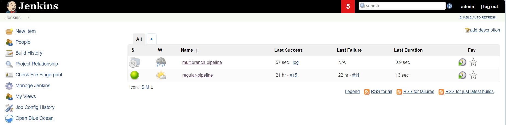

### Jenkins settings
#### Regular Jenkins pipeline
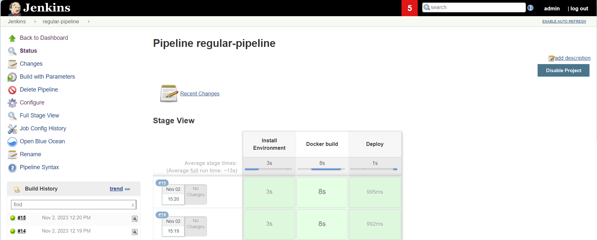
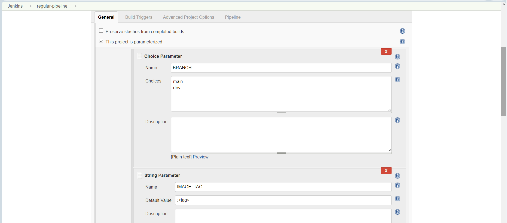
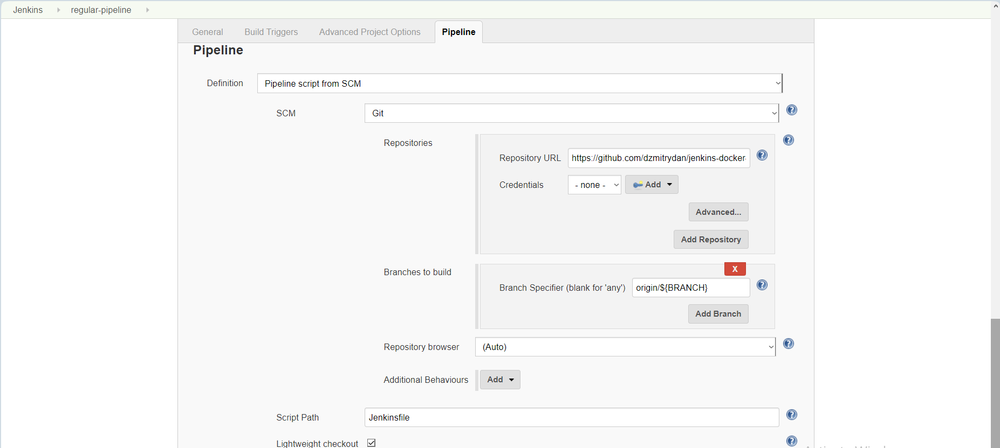
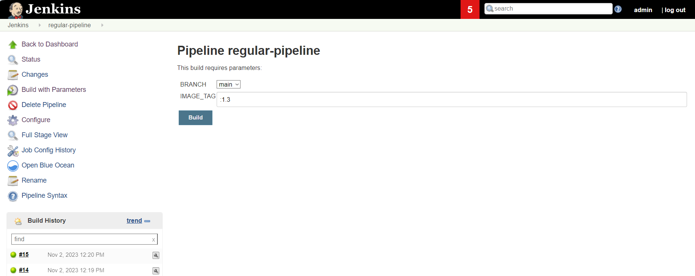

#### Multibranch Jenkins pipeline
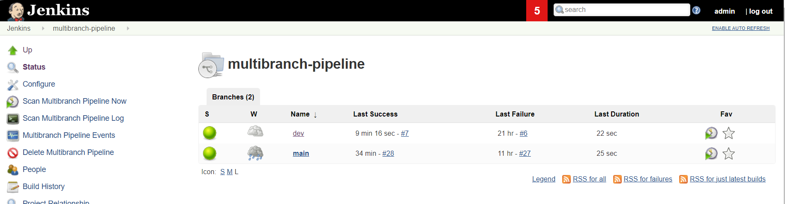
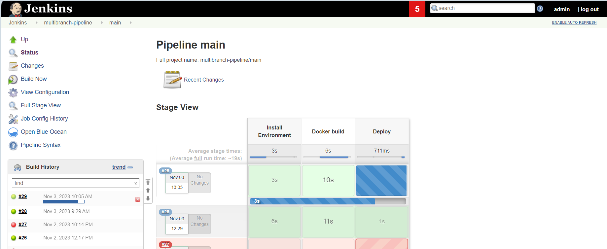
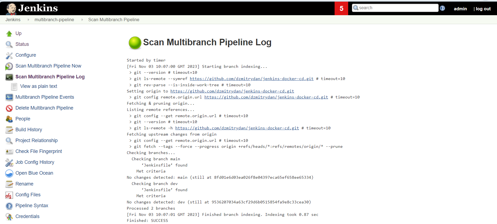
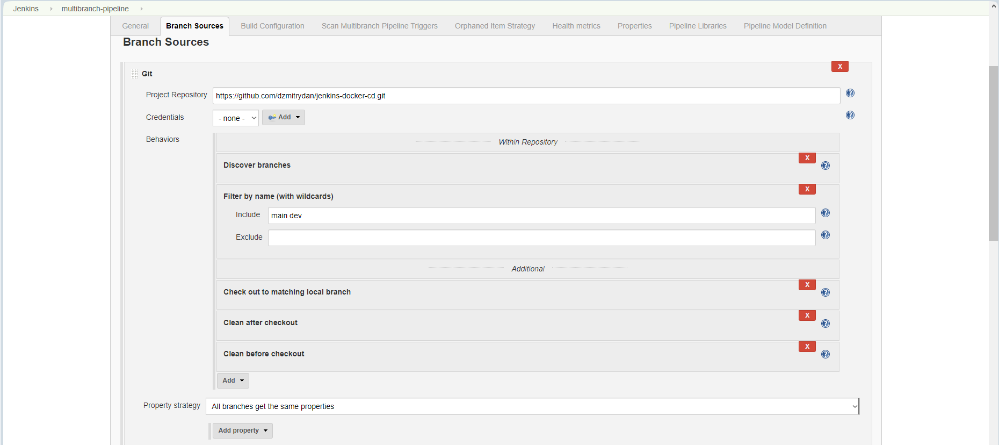
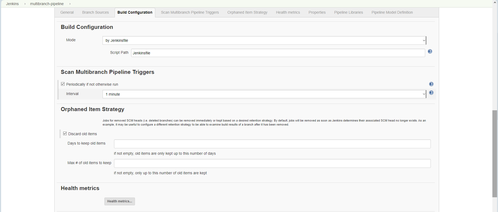

#### Docker
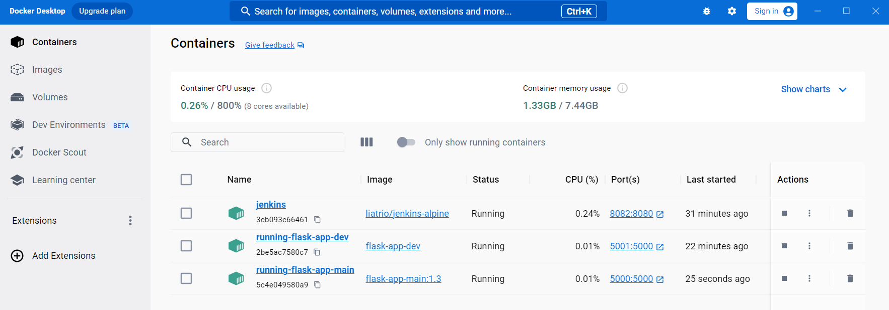
